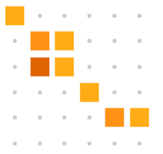
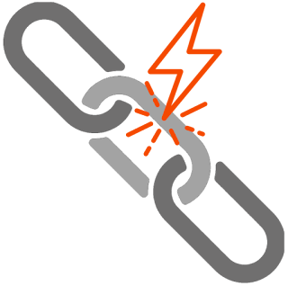
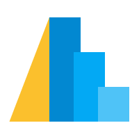
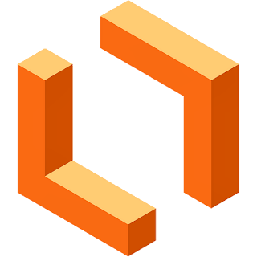

## Hi there 👋

<!-- LANGUAGES AND TOOLS SECTION -->
##  **Languages & Tools:**

<!-- > **Note:** All icon links and their sources are maintained in [assets/icon_links.md](assets/icon_links.md) for easy updates and maintenance. -->

  <!-- Programming Languages -->
  <h3>Programming Languages</h3>
  <a href="https://www.python.org/" target="_blank"> <!-- Python -->
    
  </a>
<a href="https://www.r-project.org/" target="_blank"> <!-- R -->
    
  </a>
  <a href="https://julialang.org/" target="_blank"> <!-- Julia -->
    
  </a>
<a href="https://www.mathworks.com/products/matlab.html" target="_blank"> <!-- MATLAB -->
    
  </a>

  <!-- Data Analysis -->
  <h3>Data Analysis & Wrangling</h3>
<a href="https://numpy.org/doc/" target="_blank"> <!-- NumPy -->
    
  </a>
  <a href="https://pandas.pydata.org/docs/" target="_blank"> <!-- Pandas -->
    
  </a>
<a href="https://pola.rs/" target="_blank"> <!-- Polars -->
    
  </a>
<a href="https://www.tidyverse.org/" target="_blank"> <!-- tidyverse -->
    
  </a>
<a href="https://greatexpectations.io/" target="_blank"> <!-- Great Expectations -->
    
  </a>
<a href="https://pandera.readthedocs.io/en/stable/" target="_blank"> <!-- Pandera -->
    
  </a>
<a href="https://recordlinkage.readthedocs.io/en/latest/" target="_blank"> <!-- Recordlinkage -->
  
  </a>
<a href="https://moj-analytical-services.github.io/splink/index.html" target="_blank"> <!-- Splink -->
  
  </a>
<a href="https://github.com/dedupeio/dedupe" target="_blank"> <!-- Dedupe -->
    
  </a>
<a href="https://rapidfuzz.github.io/RapidFuzz/" target="_blank"> <!-- RapidFuzz -->
    
  </a>
<a href="https://textacy.readthedocs.io/en/latest/" target="_blank"> <!-- Textacy -->
    
  </a>

  </a>

  <!-- Data Visualization -->
  <h3>Data Visualization</h3>
<a href="https://matplotlib.org/" target="_blank"> <!-- Matplotlib -->
  
</a>
<a href="https://seaborn.pydata.org/index.html" target="_blank"> <!-- Seaborn -->
  
</a>
<a href="https://ggplot2.tidyverse.org/" target="_blank"> <!-- ggplot2 -->
    
</a>
<a href="https://plotly.com/" target="_blank"> <!-- Plotly -->
    
</a>
<a href="https://altair-viz.github.io/" target="_blank"> <!-- Altair -->
  
</a>
<a href="https://holoviews.org/" target="_blank"> <!-- HoloViews -->
  
</a>
<a href="https://lux-api.readthedocs.io/en/latest/" target="_blank"> <!-- Lux -->
  
</a>
<a href="https://geopandas.org/en/stable/" target="_blank"> <!-- GeoPandas -->
  
</a>
<a href="https://qgis.org/" target="_blank"> <!-- QGis -->
  
</a>

  <!-- Statistical Modeling & Machine Learning -->
  <h3>Statistical Modeling & Machine Learning</h3>
  <a href="https://scipy.org/" target="_blank"> <!-- SciPy -->
    
  </a>
  <a href="https://www.statsmodels.org/stable/index.html" target="_blank"> <!-- Statsmodels -->
    
  </a>
  <a href="https://pingouin-stats.org/build/html/index.html" target="_blank"> <!-- Pingouin -->
    
  </a>
  <a href="https://scikit-learn.org/stable/" target="_blank"> <!-- Scikit-Learn -->
    
  </a>
 <a href="https://skrub-data.org/stable/" target="_blank"> <!-- Skrub -->
    
  <a href="https://feature-engine.trainindata.com/en/latest/" target="_blank"> <!-- Feature-engine -->
    
  </a>
  <a href="https://rasbt.github.io/mlxtend/" target="_blank"> <!-- MLxtend -->
    
  </a>
  <a href="https://www.tidymodels.org/" target="_blank"> <!-- tidymodels -->
    
  </a>
   <a href="https://facebook.github.io/prophet/" target="_blank"> <!-- Prophet -->
    
  </a>
   <a href="https://cran.r-project.org/web/packages/forecast/index.html" target="_blank"> <!-- Forecast -->
    
  </a>
  <a href="https://unit8co.github.io/darts/" target="_blank"> <!-- Darts -->
    
  </a>
  <a href="https://shap.readthedocs.io/en/latest/index.html" target="_blank"> <!-- Shap -->
    
  </a>

<!-- Databases -->
  <h3>Databases</h3>
  <a href="https://www.postgresql.org/" target="_blank"> <!-- PostgreSQL -->
    
  </a>
  <a href="https://www.microsoft.com/en-us/sql-server" target="_blank"> <!-- PostgreSQL -->
    
  </a>
  <a href="https://www.sqlite.org/docs.html" target="_blank"> <!-- SQLite -->
    
  </a>
  <a href="https://www.sqlalchemy.org/" target="_blank"> <!-- MySQL -->
    
  </a>
  <a href="https://duckdb.org/" target="_blank"> <!-- DuckDB -->
    
  </a>

  <!-- Development Tools -->
  <h3>Development Tools</h3>
  <a href="https://code.visualstudio.com/docs" target="_blank"> <!-- VScode -->
    
  </a>
  <a href="https://jupyter.org/" target="_blank"> <!-- Jupyter -->
    
  </a>
  
  <a href="https://posit.co/download/rstudio-desktop/" target="_blank"> <!-- R -->
    
  </a>
  <a href="https://www.anaconda.com/" target="_blank"> <!-- Anaconda -->
    
  </a>
  <a href="https://github.com/" target="_blank"> <!-- Git -->
    
  </a>
  <a href="https://docs.github.com/en" target="_blank"> <!-- GitHub -->
    
  </a>

  <!-- Design & Documentation Tools -->
  <h3>Design & Documentation Tools</h3>
<a href="https://www.lucidchart.com/" target="_blank"> <!-- Lucidchart -->
  
</a>
<a href="https://www.microsoft.com/en-us/microsoft-365/visio/flowchart-software" target="_blank"> <!-- Visio -->
  
</a>
<a href="https://quarto.org/" target="_blank"> <!-- Quarto -->
  
</a>
  <a href="https://www.markdownguide.org/" target="_blank"> <!-- Markdown -->
    
  </a>
<a href="https://www.canva.com/" target="_blank"> <!-- Canva -->
  
</a>
<a href="https://www.gimp.org/" target="_blank"> <!-- GIMP -->
  
</a>

  <!-- Productivity & AI -->
  <h3>Productivity & AI</h3>
  <a href="https://www.notion.so/" target="_blank"> <!-- Notion -->
    
  </a>
  <a href="https://www.perplexity.ai/" target="_blank"> <!-- Perplexity -->
    
  </a>

